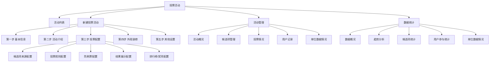

# 投票活动功能 PRD

## 1. 方案定位

### 1.1 背景
公司当前已具备较成熟的 `征集类`、`知识问答`、`活动报名` 活动创建与管理能力，其中：

- 新建活动采用统一的 `五步创建流程`
- 活动发布后具备 `活动列表`、`活动管理`、`投票/答题/报名情况`、`数据统计`、`单位数据情况` 等运营视图

投票活动建议沿用现有活动产品框架，避免再造一套独立流程。这样可以保证：

- 后台操作习惯一致，降低学习成本
- 前端页面结构高度复用，研发成本低
- 后期可与征集类活动联动，例如“作品征集结束后进入投票评选”

### 1.2 核心结论
建议采用 `五步方案新建投票活动`。

原因如下：

- 你们现有后台的活动创建心智已经稳定，新增投票不应改变主流程
- 投票活动虽然规则与问答活动不同，但差异主要集中在 `第三步：投票配置`
- 第一步、第二步、第四步、第五步都可以直接复用现有征集类 / 知识问答活动能力，仅补充少量投票特有规则提示即可

### 1.3 本次重点范围
本方案重点定义以下内容：

- 投票活动整体 PRD
- 功能结构图
- 新建活动五步流程中第三步 `投票配置`
- 活动开启后的 `投票情况` 页面
- `数据统计` 页面
- `数据统计 - 单位数据情况` 页面

不展开细写的内容：

- 第一步 `基本信息`
- 第二步 `活动介绍`
- 第四步 `外观装修`
- 第五步 `其他设置`

以上 4 步默认复用现有征集类 / 知识问答活动页面与交互，仅在“特殊规则”处补充说明。

---

## 2. 产品目标

### 2.1 业务目标

- 支持图书馆、学校、机构快速发起 `作品投票`、`人物评选`、`主题票选`、`节目票选` 等活动
- 支持与 `征集类活动` 联动，形成“征集 -> 审核 -> 展示 -> 投票 -> 评奖”闭环
- 让主办方实时掌握活动热度、候选项表现、单位组织效果

### 2.2 用户目标

后台运营人员希望：

- 快速创建投票活动
- 灵活配置投票规则，避免刷票和误投
- 实时查看候选项票数、用户参与情况、单位组织效果
- 便于导出结果，用于公示、评奖、复盘

### 2.3 成功标准

- 投票活动可在 5 步内完成配置并发布
- 第三步投票配置可以覆盖 80% 以上常见投票玩法
- 前端开发可依据本 PRD 直接输出创建页、列表页、投票情况页、统计页

---

## 3. 适用活动类型

支持的典型场景：

- 作品投票：摄影、征文、书画、视频、朗读作品评选
- 人物评选：阅读推广人、优秀馆员、校园朗读者
- 主题投票：海报票选、Logo 票选、书单票选
- 节目投票：朗诵节目、演讲节目、展演节目

建议第一期投票活动统一归为一个产品类型：`投票`

投票活动分类字段建议支持：

- 作品投票
- 人物评选
- 主题投票
- 节目投票
- 自定义

---

## 4. 功能结构图

---

## 5. 信息架构与导航建议

### 5.1 一级入口

- 工作台 > 投票

### 5.2 投票模块下建议页面

- 活动列表
- 数据概况

### 5.3 单个活动管理侧边栏建议

- 活动概况
- 候选项管理
- 投票情况
- 用户投票记录
- 数据统计
- 单位数据情况
- 排行榜 / 获奖结果

说明：

- 如果你们当前后台习惯将 `单位数据情况` 放在 `数据统计` 下级，可保持现有结构
- 如果侧边栏层级要更轻，可将 `排行榜 / 获奖结果` 放入 `投票情况` 页顶部 Tab 中

---

## 6. 新建投票活动流程

## 6.1 是否采用五步方案

建议：`采用五步方案`

### 复用逻辑

1. 第一步 `基本信息`
直接复用征集类 / 知识问答活动的新建页结构与交互。

2. 第二步 `活动介绍`
直接复用现有活动介绍编辑能力，包括 PC / 移动端介绍、图文装修、说明模块等。

3. 第四步 `外观装修`
直接复用现有活动首页装修、导航模块、榜单入口、推荐位等能力。

4. 第五步 `其他设置`
直接复用现有分享设置、动态设置、推荐设置、消息提醒等能力。

### 唯一重点差异

- 第三步从 `答题配置 / 报名配置` 替换为 `投票配置`

---

## 7. 新建活动五步说明

## 7.1 第一步：基本信息

直接复用，无需重做。

建议保留字段：

- 活动名称
- 活动分类
- 主办/承办/协办/支持单位
- 活动时间
- 报名时间（如需报名）
- 活动范围
- 参与对象
- 活动封面

### 投票特有补充规则

- `活动分类` 新增投票相关选项：作品投票 / 人物评选 / 主题投票 / 节目投票 / 自定义
- `活动时间` 需明确区分：
  - 候选项征集时间（可选）
  - 投票时间
  - 结果公示时间（可选）

如第一期不做三段时间拆分，至少支持：

- 活动展示时间
- 投票开始/结束时间

---

## 7.2 第二步：活动介绍

直接复用，无需重做。

建议投票活动介绍页常用模块支持：

- 活动背景
- 评选说明
- 投票规则
- 奖项说明
- 主办单位介绍

### 投票特有补充规则

- 页面中建议提供 `投票规则说明模块` 快捷插入
- 支持在活动详情页显著展示：
  - 每人可投几票
  - 每日是否限投
  - 是否可重复投同一候选项
  - 投票结果何时公示

---

## 7.3 第三步：投票配置

这是投票活动创建流程的核心页面。

页面目标：

- 让运营在一个步骤内完成 `候选项来源`、`投票规则`、`防作弊`、`展示规则`、`结果规则` 配置
- 配置结果足够明确，前端和后端都可以直接落实现

### 7.3.1 页面结构

建议第三步页面采用 5 个配置卡片分区，自上而下排列：

1. 候选项配置
2. 投票规则
3. 参与限制与防刷票
4. 结果展示规则
5. 排行榜与奖项规则

页面底部保留：

- 上一步
- 保存草稿
- 下一步

右侧或顶部可显示：

- 当前配置摘要
- 用户端效果预览入口

---

### 7.3.2 模块一：候选项配置

#### 目标
确定活动中的“被投对象”从哪里来，以及以什么字段展示。

#### 配置方式

候选项来源，单选：

- 手动新增候选项
- 从征集活动同步候选项
- 批量导入候选项

#### 字段与交互

1. 候选项来源
- 控件：单选卡片
- 默认值：`手动新增候选项`

2. 手动新增候选项
- 候选项名称
- 编号
- 封面图
- 简介
- 详情内容
- 所属单位
- 所属组别（可选）
- 状态：启用 / 停用

3. 从征集活动同步候选项
- 选择来源活动
- 选择同步范围：
  - 全部已审核通过作品
  - 指定组别作品
  - 指定标签作品
- 是否允许同步后继续手动增删候选项：是 / 否
- 同步字段说明：
  - 作品标题 -> 候选项名称
  - 作者/提交人 -> 候选人
  - 作品封面 -> 封面图
  - 所属单位 -> 所属单位

4. 批量导入候选项
- 下载模板
- 上传 Excel
- 导入结果反馈：
  - 成功条数
  - 失败条数
  - 失败原因

#### 页面补充开关

- 是否启用候选项分组
- 是否允许设置候选项排序
- 是否支持候选项置顶推荐

#### 前端展示建议

- 来源方式切换后展示对应表单区域
- 下方固定展示 `候选项预览表`

候选项预览表字段建议：

- 排序
- 编号
- 候选项名称
- 所属单位
- 当前状态
- 展示图
- 操作：编辑 / 删除 / 预览

---

### 7.3.3 模块二：投票规则

这是第三步中最关键的规则配置区。

#### 目标
定义“谁能投、怎么投、能投几次、一次能投几个”。

#### 建议配置分组

1. 参与方式
2. 投票次数规则
3. 单次投票规则
4. 候选项选择规则
5. 投票时间规则

#### A. 参与方式

字段：

- 是否需要报名/登录后投票
  - 免登录可投
  - 登录后可投
  - 报名后可投

- 参与身份范围
  - 全部用户
  - 指定机构用户
  - 指定组别用户
  - 指定地区用户

规则说明：

- 如活动为机构性评选，建议默认 `登录后可投`
- 如需做单位统计，建议至少要求 `登录`

#### B. 投票次数规则

字段：

- 投票口径，单选
  - 每个账号总共可投 X 次
  - 每个账号每日可投 X 次
  - 每个账号每个候选项可投 X 次
  - 每个账号总票数 + 每日票数组合限制

推荐第一期支持：

- 每个账号总共可投 X 票
- 每个账号每日可投 X 票
- 每个账号每天对每个候选项限投 X 票

配套输入项：

- 总票数上限
- 每日票数上限
- 每日对单个候选项票数上限

#### C. 单次投票规则

字段：

- 单次可选择候选项数量
  - 单选 1 项
  - 多选，最多 X 项
  - 多选，固定 X 项

- 单次提交是否消耗 1 次投票机会
  - 是
  - 否，按实际勾选票数扣减

建议默认规则：

- 多选投票按 `实际勾选候选项数` 扣票，更符合用户理解

示例：

- 用户每日 5 票
- 每次最多选 3 项
- 本次勾选 2 项并提交
- 则剩余票数减少 2 票

#### D. 候选项选择规则

字段：

- 是否允许重复投同一候选项
  - 允许
  - 不允许

- 是否必须投满可投票数才能提交
  - 是
  - 否

- 是否允许跨组投票
  - 允许
  - 不允许，仅可投本组

- 若启用分组，组内投票规则
  - 每组至少投 1 项
  - 每组最多投 X 项
  - 不限制

#### E. 投票时间规则

字段：

- 投票开始时间
- 投票结束时间
- 是否限制每日可投时段
  - 不限制
  - 限制每日时间段

如开启每日时段，字段为：

- 每日开始时间
- 每日结束时间

#### F. 页面中的规则摘要区

建议实时生成“当前规则说明”，示例：

`本活动需登录后参与。每个账号每日可投 5 票，每日对单个候选项最多投 1 票；单次最多选择 3 个候选项，按实际勾选数量扣票。`

这段摘要建议用于：

- 配置页右侧预览
- 活动详情页规则说明模块
- 管理后台确认页摘要

---

### 7.3.4 模块三：参与限制与防刷票

#### 目标
控制异常投票，保证评选公信力。

#### 第一阶段建议支持的规则

1. 账号维度限制
- 同一账号是否允许重复投票
- 同一账号每日投票上限

2. 设备维度限制
- 同一设备每日投票上限
- 同一设备对同一候选项每日上限

3. IP 维度限制
- 同一 IP 每日投票上限
- 同一 IP 短时间投票频率限制

4. 验证方式
- 无验证
- 图形验证码
- 短信验证码

5. 异常拦截
- 短时间高频投票自动拦截
- 可疑投票标记为异常票
- 异常票是否计入实时票数

#### 推荐默认值

- 登录后可投
- 开启图形验证码
- 同一设备每日投票上限：与账号上限一致
- 同一 IP 每分钟请求次数限制
- 异常票先计入 `待核查票数`，不直接进入有效票数

#### 页面字段建议

- 开启防刷票：开关
- 验证方式：单选
- 设备限制：开关 + 数值输入
- IP 限制：开关 + 数值输入
- 高频拦截阈值：数值输入
- 异常票处理方式：单选
  - 自动剔除
  - 标记待审核
  - 仅告警不处理

#### 页面提示文案

`建议正式评选活动至少开启登录校验 + 图形验证码 + 设备限制。`

---

### 7.3.5 模块四：结果展示规则

#### 目标
定义用户端是否看得到票数、排名、结果，以及何时可见。

#### 字段设计

1. 候选项票数展示
- 实时展示票数
- 仅展示排名，不展示票数
- 不展示排名和票数
- 活动结束后展示

2. 排名展示方式
- 展示全部排名
- 仅展示前 N 名
- 仅展示我的支持候选项排名
- 不展示排名

3. 用户投票结果反馈
- 投票成功后提示“已投票”
- 显示剩余票数
- 显示今日剩余票数
- 显示已支持候选项

4. 活动结束后结果公示
- 自动公示
- 手动公示
- 不公示，仅后台可见

#### 推荐默认值

- 普通拉新活动：实时展示票数 + 展示前 100 名
- 正式评选活动：仅展示排名，不展示具体票数
- 高敏感活动：活动结束后由管理员手动公示

---

### 7.3.6 模块五：排行榜与奖项规则

#### 目标
定义榜单口径，以及是否从系统自动生成获奖名单。

#### 配置字段

1. 是否开启排行榜
- 开启
- 关闭

2. 排行榜类型
- 候选项得票排行榜
- 单位组织排行榜
- 用户参与排行榜

建议第一期至少支持前两类：

- 候选项得票排行榜
- 单位组织排行榜

3. 候选项榜单展示字段
- 排名
- 候选项名称
- 封面
- 所属单位
- 票数

4. 单位榜单统计口径
- 单位累计投票数
- 单位参与投票人数
- 单位覆盖率

建议默认用：

- 单位参与投票人数
- 单位累计投票数

5. 奖项规则
- 是否开启自动奖项计算
- 奖项名称
- 获奖名额
- 获奖口径

奖项口径示例：

- 按有效票数 Top N
- 按分组内 Top N
- 指定单位内 Top N

#### 推荐实现策略

第一期可以先支持：

- 排行榜开启/关闭
- 候选项得票榜展示前 N 名
- 单位组织榜展示前 N 名
- 奖项规则先只做“后台统计口径”，不做自动发奖

---

### 7.3.7 第三步确认摘要

在第三步底部或第五步最终确认页，建议展示投票配置摘要：

- 候选项来源：手动新增 / 征集同步 / Excel 导入
- 候选项数量：X 个
- 参与方式：登录后可投
- 投票规则：每人每日 5 票，每日每候选项 1 票，单次最多选择 3 项
- 防刷规则：图形验证码 + 设备限制 + IP 限制
- 结果展示：展示前 100 名，不展示具体票数
- 榜单规则：候选项得票榜、单位组织榜

---

## 7.4 第四步：外观装修

直接复用，无需重做。

### 投票活动特殊规则

建议页面装修中默认支持以下组件开关：

- 活动首页
- 候选项列表
- 排行榜
- 活动规则
- 主办单位
- 推荐内容

建议投票活动默认开启：

- 候选项列表
- 排行榜入口
- 活动规则模块

---

## 7.5 第五步：其他设置

直接复用，无需重做。

### 投票活动特殊规则

建议补充或默认支持：

- 分享文案设置
- 分享海报设置
- 消息提醒设置
- 结果公示提醒
- 异常投票预警通知

---

## 8. 活动列表页 PRD

## 8.1 页面目标

帮助运营快速查看全部投票活动，并进行检索、管理、复制、下架、查看数据。

## 8.2 页面结构

1. 顶部筛选区
2. 列表区
3. 顶部右侧 `新建投票活动` 按钮

## 8.3 筛选项

- 活动名称
- 活动状态：未开始 / 进行中 / 已结束 / 已下架
- 投票类型：作品投票 / 人物评选 / 主题投票 / 节目投票 / 自定义
- 创建时间
- 主办单位

## 8.4 列表字段

- 活动名称
- 活动状态
- 活动时间
- 投票时间
- 累计票数
- 参与人数
- 候选项数量
- 投票类型
- 创建人
- 操作

操作建议：

- 进入管理
- 编辑
- 复制
- 下架 / 发布
- 查看数据

---

## 9. 活动开启后：投票情况页 PRD

## 9.1 页面目标

用于查看当前活动中各候选项的投票表现，是投票活动最核心的运营页。

## 9.2 页面定位

建议作为活动管理下的独立菜单：

- 活动管理 > 某投票活动 > 投票情况

## 9.3 页面结构

1. 顶部核心指标卡
2. 趋势图
3. 候选项列表 / 排名表
4. 异常票监控区

## 9.4 顶部指标卡

- 累计总票数
- 有效票数
- 异常票数
- 参与人数
- 候选项数量
- 今日新增票数

## 9.5 趋势图

建议支持：

- 按天查看投票量趋势
- 按天查看参与人数趋势
- 按小时查看今日投票峰值

图表切换：

- 近 7 天
- 近 15 天
- 近 30 天
- 自定义时间

## 9.6 候选项排名表

筛选项建议：

- 候选项名称
- 所属单位
- 候选项分组
- 状态
- 排名区间

表格字段建议：

- 当前排名
- 候选项名称
- 编号
- 所属单位
- 总票数
- 有效票数
- 异常票数
- 参与用户数
- 今日新增票数
- 票数占比
- 操作

操作建议：

- 查看详情
- 查看投票明细
- 查看拉票趋势
- 置顶 / 取消置顶

## 9.7 候选项详情抽屉

打开后展示：

- 候选项基础信息
- 总票数 / 有效票 / 异常票
- 近 7 日票数趋势
- 来源渠道分布（如后续有渠道）
- 单位贡献分布

## 9.8 异常票监控区

第一期可以简化为 1 个列表卡片：

- 异常时间
- 候选项
- 触发规则
- 票数
- 处理状态

操作：

- 标记有效
- 标记无效
- 批量导出

---

## 10. 数据统计页 PRD

## 10.1 页面目标

用于看整个活动的数据全貌，区别于“投票情况”更偏候选项运营，“数据统计”更偏管理分析与复盘。

## 10.2 页面定位

- 活动管理 > 某投票活动 > 数据统计

## 10.3 页面结构建议

采用 `Tab` 结构：

1. 数据概况
2. 候选项统计
3. 用户参与统计
4. 单位数据情况

---

## 10.4 Tab1：数据概况

### 顶部指标卡

- 累计总票数
- 有效票数
- 异常票数
- 参与人数
- 人均投票次数
- 候选项数
- 覆盖单位数

### 图表区

1. 投票趋势图
- 日期维度票数趋势
- 日期维度参与人数趋势

2. 候选项票数分布图
- Top10 候选项票数柱状图

3. 投票时段分布图
- 24 小时分布

4. 单位参与分布图
- 各单位参与人数 / 投票量 Top10

---

## 10.5 Tab2：候选项统计

### 页面目标
分析候选项表现。

### 筛选项

- 候选项名称
- 所属单位
- 候选项分组
- 时间范围

### 表格字段

- 排名
- 候选项名称
- 所属单位
- 总票数
- 有效票数
- 异常票数
- 参与人数
- 人均单用户投票数
- 每日平均增票
- 最高单日票数

### 支持操作

- 导出
- 查看详情

---

## 10.6 Tab3：用户参与统计

### 页面目标
分析用户参与深度和活跃情况。

### 核心指标

- 参与用户总数
- 新增参与用户数
- 复投用户数
- 人均投票次数
- 登录用户占比
- 单位用户占比

### 筛选项

- 时间范围
- 用户姓名/昵称
- 手机号
- 所属单位

### 表格字段

- 用户昵称/姓名
- 所属单位
- 累计投票次数
- 投票候选项数
- 最近投票时间
- 异常标记

---

## 10.7 Tab4：单位数据情况

该页是本次重点页面之一，单独展开如下。

---

## 11. 单位数据情况页 PRD

## 11.1 页面目标

让主办方了解“每个单位组织得怎么样”，用于判断单位发动效果、参与深度、候选项支持度。

这个页面尤其适用于：

- 校园/馆际联合评选
- 区县/系统内单位组织型活动
- 面向各分馆、各学校、各机构的拉通评比活动

## 11.2 页面定位

- 活动管理 > 某投票活动 > 数据统计 > 单位数据情况

## 11.3 页面结构

建议采用：

1. 顶部说明卡
2. 筛选区
3. 单位汇总表
4. 单位详情抽屉/明细页

如你们希望与现有知识问答统一，也可以做成：

- 顶部模式切换
- 表格
- 明细页

但投票活动不建议沿用 `在线考试 / 每日答题 / 闯关` 三种模式切换，建议改成更贴近投票业务的模式切换。

---

## 11.4 顶部模式切换建议

建议投票活动单位数据页采用以下 3 个模式：

1. 参与情况
2. 投票贡献
3. 候选项支持

### 模式一：参与情况
看各单位有多少人参与投票。

### 模式二：投票贡献
看各单位贡献了多少票。

### 模式三：候选项支持
看各单位主要把票投给了哪些候选项。

---

## 11.5 筛选区

字段建议：

- 单位名称
- 单位类型
- 时间范围
- 候选项分组
- 候选项名称

按钮：

- 查询
- 重置
- 导出

---

## 11.6 模式一：参与情况

### 指标定义

- 单位参与人数：该单位有投票行为的去重用户数
- 可参与人数：该单位具备参与资格的用户数
- 参与率：单位参与人数 / 可参与人数

### 表格字段

- 排名
- 单位名称
- 单位类型
- 可参与人数
- 参与人数
- 参与率
- 今日新增参与人数
- 人均投票次数
- 最近投票时间
- 操作

操作：

- 查看单位明细

---

## 11.7 模式二：投票贡献

### 指标定义

- 累计投票数：该单位用户贡献的总投票数
- 有效投票数：剔除异常票后的有效票数
- 人均投票数：累计投票数 / 参与人数

### 表格字段

- 排名
- 单位名称
- 参与人数
- 累计投票数
- 有效投票数
- 异常票数
- 人均投票数
- 今日新增票数
- 票数占比
- 操作

---

## 11.8 模式三：候选项支持

### 页面目标
查看每个单位主要支持了哪些候选项，适合做拉票分析与组织分析。

### 表格字段

- 单位名称
- Top1 支持候选项
- Top1 票数
- Top2 支持候选项
- Top2 票数
- Top3 支持候选项
- Top3 票数
- 本单位投票覆盖候选项数
- 操作

操作：

- 查看单位支持明细

---

## 11.9 单位详情页/抽屉

点击某单位后进入详情。

建议展示 4 个区块：

1. 单位概况
- 单位名称
- 可参与人数
- 参与人数
- 参与率
- 累计投票数

2. 候选项支持分布
- 该单位投给各候选项的票数排行

3. 用户投票明细
- 用户姓名
- 投票次数
- 投票候选项数
- 最近投票时间
- 是否异常

4. 时间趋势
- 该单位每日投票趋势

---

## 12. 前端页面输出建议

为了让前端开发可以直接开工，建议按以下页面清单拆分：

### 12.1 页面清单

1. 投票活动列表页
2. 新建投票活动页
   - 第一步：基本信息（复用）
   - 第二步：活动介绍（复用）
   - 第三步：投票配置（新做）
   - 第四步：外观装修（复用）
   - 第五步：其他设置（复用）
3. 投票活动管理首页 / 概况页
4. 候选项管理页
5. 投票情况页
6. 数据统计页
7. 单位数据情况页
8. 单位详情页 / 抽屉

### 12.2 第三步投票配置页推荐区块顺序

1. 候选项配置
2. 投票规则
3. 参与限制与防刷票
4. 结果展示规则
5. 排行榜与奖项规则
6. 当前配置摘要

### 12.3 前端复用建议

- 复用现有五步创建骨架
- 复用现有表单组件、时间组件、顶部步骤条
- 复用现有确认页摘要样式
- 复用现有数据统计指标卡、筛选区、表格、导出按钮

---

## 13. 字段口径定义

为避免前后端口径不一致，建议先固定以下定义：

- 总票数：所有成功提交的票数总和，含异常票
- 有效票数：通过风控校验或人工确认的有效票数
- 异常票数：被风控标记为异常的票数
- 参与人数：至少成功投过 1 次票的去重用户数
- 候选项数：当前活动中处于启用状态的候选项数量
- 单位参与人数：某单位内至少成功投过 1 次票的去重用户数
- 单位累计投票数：某单位用户贡献的票数总和
- 单位参与率：单位参与人数 / 单位可参与人数

---

## 14. 第一阶段建议范围

建议第一期先做 `高频刚需`，避免配置过重。

### 建议第一期必须支持

- 五步创建
- 第三步投票配置
- 手动新增候选项
- 从征集活动同步候选项
- 每日/总票数限制
- 单次单选/多选
- 是否允许重复投同一候选项
- 登录投票
- 图形验证码
- 票数/排名展示配置
- 投票情况页
- 数据统计页
- 单位数据情况页
- 导出

### 建议第一期可暂不支持

- 短信验证码
- 自动发奖
- 复杂组间配票
- 多轮投票
- 渠道归因分析
- 高级风控策略编排

---

## 15. 风险与注意事项

### 15.1 规则复杂度风险

投票规则天然容易越做越复杂，因此建议第一期只支持“主流规则组合”，避免把第三步做成低频复杂系统。

### 15.2 数据口径风险

`总票数`、`有效票数`、`异常票数`、`参与人数` 必须在全站统一，否则前台、后台、统计页会出现对不上。

### 15.3 与征集活动联动风险

若存在“征集作品同步为候选项”，需提前明确：

- 同步时点
- 审核状态要求
- 同步后是否脱钩
- 原作品删除后是否影响候选项

建议第一期规则：

- 仅同步 `审核通过` 的作品
- 同步后生成独立候选项快照，不随原作品修改实时变更

---

## 16. 最终建议

### 16.1 总体建议

投票活动非常适合沿用现有 `五步新建活动` 模式。

### 16.2 设计重点

产品设计重点放在：

- 第三步 `投票配置`
- 活动开启后的 `投票情况`
- `数据统计`
- `单位数据情况`

### 16.3 页面实现优先级

优先级建议：

1. 新建活动第三步投票配置
2. 投票活动列表页
3. 投票情况页
4. 数据统计页
5. 单位数据情况页

---

## 17. 可直接给前端的简版页面定义

### 新建活动第三步页面

- 页面标题：投票配置
- 页面分区：候选项配置 / 投票规则 / 参与限制与防刷票 / 结果展示规则 / 排行榜与奖项规则 / 当前配置摘要
- 页面按钮：上一步 / 保存草稿 / 下一步

### 投票情况页

- 页面标题：投票情况
- 页面区块：指标卡 / 趋势图 / 候选项排名表 / 异常票监控

### 数据统计页

- 页面标题：数据统计
- 页面 Tab：数据概况 / 候选项统计 / 用户参与统计 / 单位数据情况

### 单位数据情况页

- 页面标题：单位数据情况
- 页面模式：参与情况 / 投票贡献 / 候选项支持
- 页面区块：模式切换 / 筛选区 / 表格 / 单位详情

